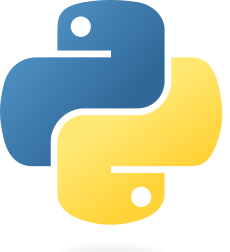

<h1 align="center">
 Learn Python

   
   

  
</h1>

Welcome to our Python for Beginners tutorial! This tutorial is designed for individuals who are new to programming and want to learn how to use Python.

We will start with the basics of Python programming and gradually move on to more advanced topics. Each topic will be explained in a simple and easy-to-understand manner with practical examples.

## Getting Started

### Installing Python

Before we can begin writing Python code, we need to install Python on our computer.
You can download Python from the official website [https://www.python.org/downloads/](https://www.python.org/downloads/).

We are using Python3 in this tutorial. If you are using Python2, you may need to make some changes to the code.

### Running Python

Once you have installed Python, you can run it by opening the command prompt and typing `python3`. You can also run Python programs by opening the command prompt and typing `python3 <filename.py>`.

There are several ways to run Python programs apart from opening the command prompt and typing "python3 <filename.py>". Some of them are:

Integrated Development Environment (IDE): An IDE is a software application that provides a comprehensive environment for writing and testing code. Some popular IDEs for Python are PyCharm, Spyder, and Visual Studio Code. These IDEs allow you to create a new Python project, write and edit code, debug and test your code, and run Python programs with just a few clicks.

Jupyter Notebook: Jupyter Notebook is a web-based interactive computational environment that allows you to create and share documents that contain live code, equations, visualizations, and narrative text. Jupyter Notebook supports several programming languages, including Python. You can write Python code in individual cells, run them, and see the output directly in the notebook.

Online Python interpreters: There are several online Python interpreters available that allow you to write and run Python code without installing anything on your computer. Some popular online Python interpreters are Repl.it, CodePen, and OnlineGDB.

To run Python using an IDE or Jupyter Notebook, you first need to install the respective software on your computer and set up the environmentset. However, using an online Python interpreter is a quick and easy way to get started with Python without any installation since it does not require any installation.
